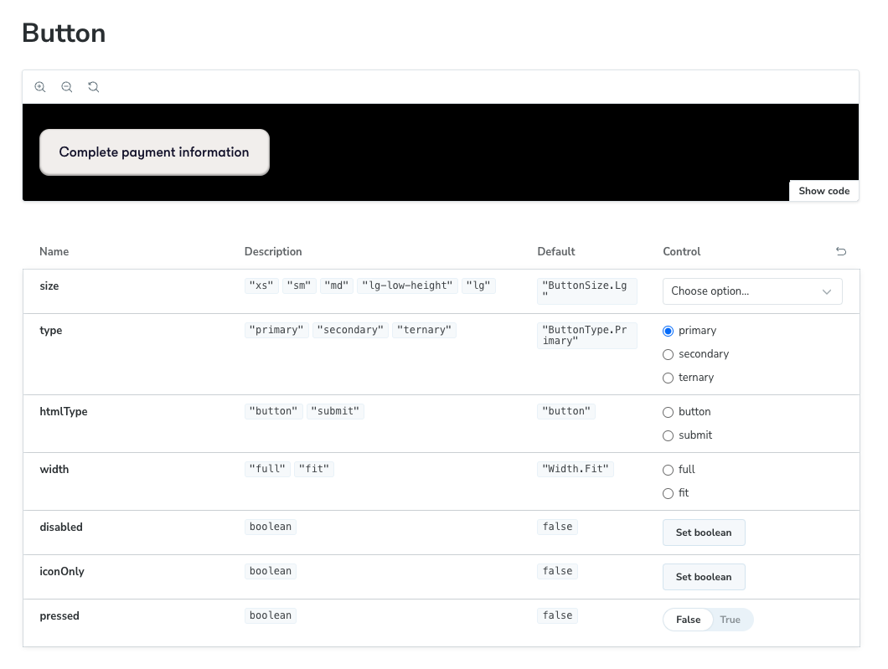
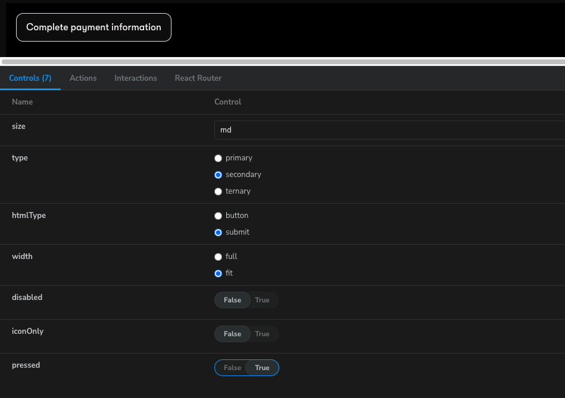
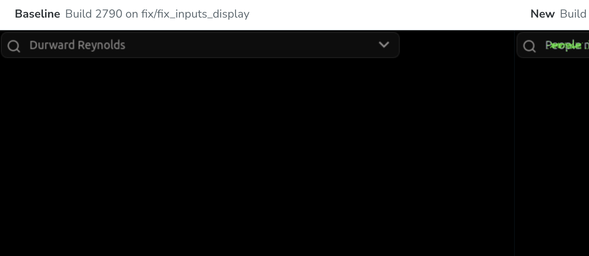
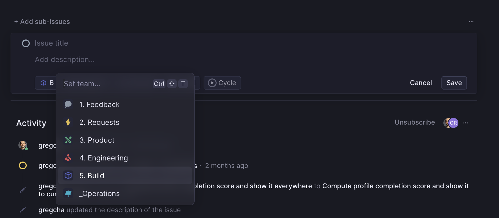

# Frontend documentation

## Installation process v2

Install [Vite](https://vitejs.dev/) - with Homebrew:

```
brew install vite
```

Install packages with:

```
yarn
```

You can then start the frontend with:

```
yarn dev
```

If you plan on running end-to-end tests, use:

```
yarn dev ---host
```

### Codegen

A code generation plugin is used to automatically generate Typescript types for the frontend,
based on the queries provided by Hasura as well as queries defined in `queries.graphql` files.

It can be launched in watch mode with the following command :

```
yarn generate --watch
```

### LazyNPM (experimental)

You can use [LazyNPM](https://github.com/jesseduffield/lazynpm) to have a graphical interface allowing to launch the scripts more quickly.

This is convenient but the GUI tends to break down when one of the services encounters an error.

When LazyNPM is installed, you can just launch it at the root of the project with:

```
lazynpm
```

## Description of the app

The marketplace project is organized in different components and routes. The main entry point for the application is the `App` component, which is responsible for rendering the different pages and routes of the application. It imports various components and libraries from the React ecosystem, as well as custom components and types from the project.

The `App` component defines an enumeration called `RoutePaths` that represents the different routes of the application. It also defines enumerations called `ProjectRoutePaths` and `ProjectPaymentsRoutePaths` that represent sub-routes within the project details and project payments pages, respectively.

The `App` component defines arrays called `projectRoutes` and `routes` using the `useRoutes` hook. These arrays represent the routes of the application and include nested routes and protected routes based on user roles.

The `Layout` component is responsible for rendering the layout of the marketplace application. It uses various components and hooks to create the desired layout, such as `classNames`, `Outlet`, `useLocation`, `ResponsivityFallback`, `Toaster`, `Header`, and `Tooltip`. The `Layout` component conditionally renders the `ResponsivityFallback` component and controls the visibility of the main content based on the current location.

## Development process

### Storybook

It is highly encouraged to use Storybook while implementing the design of a component.

Storybook allows to display and implement a component in isolation. It is also possible to display several variants of a component -
which makes it the ideal place to describe a design system.

This is easier to do if the component has been properly split between logic and presentation like above.

#### Interface

Storybook can be launched using the following command:

```
yarn storybook
```

This will open an interface (accessible by default [locally on the 6006 port](http://localhost:6006)).

For each component, a _Docs_ section displays the generated documentation for the component :



Then, there is a section for each story, with the relevant parameters that can be modified to see the variants of a component.



#### Creating a story

A story should be named according to the `<COMPONENT_NAME>.stories.tsx` (e.g. `Button.stories.tsx`) and should be colocated with the `index.tsx` and `View.tsx` files.

## Code guidelines

### Custom hooks

Complex logic for a use case - particularly with complex `useEffect` calls - should be extracted in a [custom hook](https://react.dev/learn/reusing-logic-with-custom-hooks).

See the React documentation about [when to use custom hooks](https://react.dev/learn/reusing-logic-with-custom-hooks#when-to-use-custom-hooks).

_Beware that custom hooks don't share state between components in which they are used_ - in order to achieve this, you need to use a `Context`.
See this [article by Kent C. Dodds](https://kentcdodds.com/blog/how-to-use-react-context-effectively) on the subject.

### Rule of three

> Two instances of similar code do not require refactoring, but when similar code is used three times, it should be extracted into a new procedure.

### Container and Presentational Components

It is a good idea to separate a component between an `index.tsx` and a `View.tsx` file.

[See more about this](./making-a-component.html#separating-presentation-and-logic)

## Making a component

### When to add a component to the `components` folder ?

The folder structure of the app follows what is known as a [Fractal structure](https://hackernoon.com/fractal-a-react-app-structure-for-infinite-scale-4dab943092af).

In other words, only add a component to the `components` folder when it is used in more than two pages or components.

### Separating presentation and logic

Components that have complex logic, queries, etc ... should be split in two files inside a dedicated folder:
`index.tsx` for the logical part and `View.tsx` for the visual part.

Example:

`index.tsx`

```tsx
export default function Component() {
  const { data } = useQuery<T>(MY_QUERY);
  return <View items={data} />;
}
```

`View.tsx`

```tsx
interface ComponentViewProps {
  data: T;
}

export default function ComponentView({ data }: ComponentViewProps) {
  return <div className="align-center flex flex-row px-6">// ...</div>;
}
```

## Adding a new page

### Page template

```tsx
export default function Page() {
    return <Background roundedBorders = {BackgroundRoundedBorders.Full} >
    <div className = "flex flex-col justify-center items-center text-greyscale-50" >
        // Rest of content here ...
        </div>
        < /Background>
}
```

### Updating the router

The routes variable in the App component defines the different routes of the application. It is structured as an array and includes routes for the impersonation page, projects page, terms and conditions page, payments page, login page, project details page, catch-all page, and error page.

These routes are defined using the useRoutes hook from the `react-router-dom` library. The routes are nested and can be accessed by navigating through the application. For example, the project details page has nested routes for the overview, contributors, and payments sub-pages.

Add the route to the `routes` object in `./frontend/src/App/index.tsx`:

```tsx
const routes = useRoutes([...]);
```

### Example of a page

The `Projects` component is responsible for rendering a page that displays a list of projects. It imports dependencies and components such as `Background`, `FilterPanel`, `useAuth`, and `useT`. It defines an enum called `Sorting` for different sorting options and uses the `useLocalStorage` hook to store and retrieve the selected sorting option. The component renders the `Background` component, `ProjectFilterProvider`, and a list of projects using the `AllProjects` component.

### Example of a component

The `ProjectDetails` component is responsible for rendering the details of a specific project. It imports dependencies and components such as `Navigate`, `useParams`, `LanguageMap`, `ProjectLeadFragment`, `SponsorFragment`, and `View`. It defines an interface called `ProjectDetails` for the structure of a project object. The component uses the `useParams` hook to extract the `projectId` from the URL parameters and the `useProjectVisibility` hook to determine if the project is visible to the current user. It conditionally renders the `View` component or navigates to the `Projects` route.

## Adding a new GraphQL query

### Instructions

A new GraphQL query / mutation can be written in the same file as the component that needs it or in a separate `queries.graphql` / `mutations.graphql` file, in order for hooks to automatically get generated by the [codegen](./getting-started.html#codegen).

See [here](https://graphql.org/learn/queries/) for more information about how to write GraphQL queries and mutations.

### Writing the query

The `gql` template literal is imported from the `@apollo/client` package. It is used to define GraphQL queries in the code. In the `GithubRepoDetails` component, the `gql` template literal is used to define the `GetGithubRepositoryDetails` query.

Here's an example of how the `gql` template literal is used to define the query:

```typescript
import { gql } from "@apollo/client";

const GetGithubRepositoryDetails = gql`
  query GetGithubRepositoryDetails($githubRepoId: bigint) {
    githubReposByPk(githubRepoId: $githubRepoId) {
      ...GithubRepo
    }
  }

  fragment GithubRepo on GithubRepo {
    name
    description
    // ... other repository fields
  }
`;
```

The `GetGithubRepositoryDetails` query fetches the details of a GitHub repository based on the `githubRepoId` variable. It includes the `...GithubRepo` fragment, which specifies the fields to be fetched for the repository.

The `gql` template literal allows for writing GraphQL queries in a readable and type-safe manner within JavaScript or TypeScript code. It also enables tools like Apollo Client to parse and validate the queries at build time.

In the above example, the query is written inside the component, but _ideally the query should be written in a `queries.graphql` or `mutations.graphql` file, colocated with the relevant component_, just writing what is in the `gql` tag with the relevant fragments defined before being used, i.e.:

```graphql
fragment GithubRepo on GithubRepo {
  name
  description
  // ... other repository fields
}

query GetGithubRepositoryDetails($githubRepoId: bigint) {
  githubReposByPk(githubRepoId: $githubRepoId) {
	...GithubRepo
  }
}
```

### Hook

The `useGetGithubRepositoryDetailsQuery` hook is used to fetch details of a GitHub repository. It is imported from the `src/__generated/graphql` file. This hook is generated by Apollo Client based on the query added to a `queries.graphql file`

To use the hook, the `githubRepoId` prop is passed as a variable to the query. The query itself is defined using the `gql` template literal tag. It is a GraphQL query named `GetGithubRepositoryDetails` that takes a single variable `githubRepoId` of type `bigint`. The query fetches the details of a GitHub repository with the given ID and includes the `...GithubRepo` fragment.

Here's an example of how the `useGetGithubRepositoryDetailsQuery` hook is used in the `GithubRepoDetails` component:

```tsx
import { useGetGithubRepositoryDetailsQuery } from "src/__generated/graphql";

const GithubRepoDetails: React.FC<{ githubRepoId: number }> = ({ githubRepoId }) => {
  const { data } = useGetGithubRepositoryDetailsQuery({
    variables: { githubRepoId },
  });

  // Render the fetched data
  if (data?.githubReposByPk) {
    return <View {...data.githubReposByPk} />;
  }

  return null;
};
```

### Using query results

The `View` component is imported from the local directory. It is used to render the fetched repository details in the `GithubRepoDetails` component. The `View` component likely contains the UI elements and layout for displaying the repository details.

The `View` component receives the fetched repository details as props. In the example code above, the fetched repository details are spread as props using the spread operator (`...data.githubReposByPk`). This allows the `View` component to access and render the specific details of the GitHub repository.

Here's an example of how the `View` component might be implemented:

```tsx
type ViewProps = {
  name: string;
  description: string;
  // ... other repository details
};

const View: React.FC<ViewProps> = ({ name, description }) => {
  return (
    <div>
      <h1>{name}</h1>
      <p>{description}</p>
      {/* Render other repository details */}
    </div>
  );
};
```

## Unit tests

Unit tests are used to test utilities and reusable logical components (which are ofter extracted in custom hooks).

They use [Vitest](https://vitest.dev/) and [React Testing Library](https://testing-library.com/docs/react-testing-library/intro/).

### Testing utility functions

This is like your regular tests using Jest.

### Testing hooks

Hooks can be "rendered" using React Testing Library in order to be tested.

There is an example in the codebase with the `useRoles` hook:

```typescript
import { renderHook } from "@testing-library/react-hooks";

it("should return Public role when no token is provided", () => {
  const { result } = renderHook(() => useRoles());
  expect(result.current.roles).toEqual([HasuraUserRole.Public]);
});
```

The `rerender` function can be destructured from the result of the `renderHook` function
in order to manually reload a hook.

There is another example of this with the `useRoles` hook:

```typescript
it("should update the loggedIn flag when a token is given", () => {
  const { result, rerender } = renderHook((accessToken?: AccessToken) => useRoles(accessToken));
  expect(result.current.isLoggedIn).toBeFalsy();

  const jwtString = "some-token" as AccessToken;
  rerender(jwtString);

  expect(result.current.isLoggedIn).toBeTruthy();
});
```

## Integration tests

Integration test more complex behaviors, namely those of whole components.

Integration tests, like unit tests, use [Vitest](https://vitest.dev/) and [React Testing Library](https://testing-library.com/docs/react-testing-library/intro/), using more sophisticated features of the latter.

## End-to-end tests

End-to-end tests are test that launch the app, open a browser and test a few critical user paths.

These tests are made using [Playwright](https://playwright.dev/).

### Running the tests

In order to run the test, the app should be running locally - with the frontend running with the `--host` flag, see [this section](./getting-started.html#development-setup) for more info.

You can then run:

```
make playwright/test
```

### Running tests individually

Before running tests individually, the `__populate` test should be run:

```
yarn run playwright test --grep __populate
```

Then any test can be run by specifying a test name's substring after the `--grep` flag:

```
yarn run playwright test --grep TEST_NAME_SUBSTRING
```

### Debug mode

Tests can be run in _debug mode_, i.e. line-per-line with a debugger, using the following command:

```
yarn run playwright test --grep TEST_NAME_SUBSTRING --debug --reporter line
```

This allows to either play the test while following which line the test is one, or stepping through the test line-per-line.

## Chromatic reviews

[Chromatic](https://www.chromatic.com/) is a visual regression cloud tool that uses Storybook to check whether differences in component rendering.

Chromatic basically launches Storybook and takes a screenshot of a component for two commits and compares them.

In our case, Chromatic is integrated in our CI/CD pipeline, and it is required to review detected Storbybook changes in Chromatic in order
to merge a pull request.

If changes are detected, then the reviewer will have to review each change and accept it manually - to inspect further, it is possible to open the Storybooks of the two branches being compared:



See [this paragraph](./making-a-component.html#storybook) for more info on how to use Storybook.

## QA Testing

### Testing on `develop`

Changes merged on the `main` branch can be reviewed on the develop environment:

For the platform:

`https://develop.app.onlydust.xyz/`

For Hasura:

`http://develop.hasura.onlydust.xyz`

### Deploying on `staging`

Staging deployment can be done using the following command:

```
./scripts/promote.sh --staging
```

This will run a script with several prompts.

At one point, environment variables that have changed compared to the last deployment will be listed. If they haven't been updated yet on Heroku or Vercel ([see here](./getting-started#websites)), now is the time to do it. You should also update the variables for the _production_ environment.

### Launching the QA session

The QA session can be launched by typing `/test` and pressing the `Enter` key in the product channel on Slack.


## Production deployment

Production deployment can be done using the following command:

```
./scripts/promote.sh --production
```

This will run a script with several prompts.

At one point, environment variables that have changed compared to the last deployment will be listed. If they haven't been updated yet on Heroku or Vercel ([see here](./getting-started#websites)), do it - but it should ideally have been done during staging deployment.

## Choosing a task to work on

### Bugs

_Bugs_ should be taken in priority when possible.
They can be found in the _Backlog_ column of the _Engineering_ board.

### Features

_Features_ can also be found in the _Backlog_ column of the _Engineering_ board, and are sorted in descending priority order.

#### Feature specification

It can be useful to write a breakdown of the necessary steps to complete a task.

This can either be done in the Engineering ticket itself or by creating subtasks in the _Build_ board.

Creating subtasks can be achieved by clicking the _Add sub-issues_ button on the ticket.

Don't forget to choose the _Build_ board as shown below:



### Tech tasks

Tech tasks can be linked to refactoring, perf issues, etc...

They usually have less priority than other features.

#### Spike

A spike is a task that is meant to start in to investigation into a complex topic (ex: setting up a new tools, investigating logging costs ...).

It is usually timeboxed to one day and should result in creating other tasks with more concrete steps to take.

### Snack

A snack is a short task that should be completed in one or two hours.

## How to create a project locally ?

This examples works for a local setup but also work in stagin or development by going to [the develop](http://develop.hasura.onlydust.xyz) or [staging](staging.hasura.onlydust.xyz) Hasura consoles.

Laucnh the hasura console by running:

```
yarn hasura:console:start
```

Access the GraphiQL interface (test tube icon tab) of the [local Hasura console](http://localhost:9695).

Add a _mutation_ in the lower left corner, and choose the `createProject` mutation - with as parameters (for example):

```typescript
mutation MyMutation {
  createProject(
    longDescription: "Lorem ipsum dolor sit amet, consectetur adipiscing elit, sed do eiusmod tempor incididunt ut labore ...",
    name: "Lorem",
	shortDescription: "Lorem Ipsum",
	initialBudget: 10000,
	visibility: PUBLIC
  )
}
```

Run the mutation with the "Play" symbol.

The project will be created

### How to become a project leader ?

Then, save the project ID that is displayed by the interface, e.g.:

```json
{
  "data": {
    "createProject": "92c22e51-5e21-44d5-bf51-d8d265849ce5"
  }
}
```

Finally, you need to invite yourself as a project leader. To achieve this, you will need the project ID shown above as well as you GitHub user ID, which can be found using the _GitHub users API_, for example: https://api.github.com/users/oscarwroche .

```typescript
mutation MyMutation {
  inviteProjectLeader(
    githubUserId: 21149076,
	projectId: "92c22e51-5e21-44d5-bf51-d8d265849ce5"
  )
}
```

Then, go to the marketplace's home page, logged in as the aforementioned GitHub user. You should see an invite that you can accept to become a project leader, and access the payment sending options.

#### Linking a GitHub repo

_It is important to follow these instructions, otherwise multiple issues will be created on public repositories when sending a payment request_

_Fork_ an existing repo with the _onlydustxyz_ oragnization.

Then, call the `linkGithubRepo` mutation using the project ID shown above, and the ID of this repo, which can be found thanks to the _Github Repos API_, for example: https://api.github.com/repos/facebook/react .

```typescript
mutation MyMutation {
  linkGithubRepo(
    githubRepoId: 78853160,
	projectId: "92c22e51-5e21-44d5-bf51-d8d265849ce5"
  )
}
```

## Boilerplate / setup

### Expect DOM-related stuff

Some content related to the DOM, and accessed with queries / selectors such as `screen.findByText(...)` needs to be compatible with the Vitest `expect` function.

This is possible with the following lines of code that are present in every intregration test:

```typescript
import matchers from "@testing-library/jest-dom/matchers";

expect.extend(matchers);
```

### Mocking authentication mechanisms

A few things are regularly accessed by components, such as user and auth info.
The token refresh mechanism hence needs to be mocked.

The following code is often used in the beginning of files (and could / should probably be refactored):

```typescript
const HASURA_TOKEN_WITH_VALID_JWT_TEST_VALUE = {
  user: {
    id: TEST_USER_ID,
  },
  accessToken: "VALID_ACCESS_TOKEN",
  accessTokenExpiresIn: 900,
  creationDate: new Date().getTime(),
  refreshToken: "test-refresh-token",
};

vi.mock("axios", () => ({
  default: {
    post: (url: string, tokenSet?: TokenSet) => ({
      data: tokenSet?.refreshToken ? HASURA_TOKEN_WITH_VALID_JWT_TEST_VALUE : HASURA_TOKEN_BASIC_TEST_VALUE,
    }),
  },
}));

vi.mock("jwt-decode", () => ({
  default: (jwt: string) => {
    if (jwt === "VALID_ACCESS_TOKEN") {
      return {
        [CLAIMS_KEY]: { [PROJECTS_LED_KEY]: `{"${TEST_PROJECT_ID}"}`, [GITHUB_USERID_KEY]: TEST_GITHUB_USER_ID },
      };
    } else throw "Error";
  },
}));
```

### Mocking history

The browser history can be mocked using our `MemoryRouterProviderFactory` utility wrapper as follows (this is a modified example from the `src/App/App.test.tsx` file:

```tsx
import App, { RoutePaths } from "src/App";

render(<App />, {
  wrapper: MemoryRouterProviderFactory({
    route: `${RoutePaths.Projects}`,
  }),
});
```

### Mocking GraphQL stuff

GraphQL queries / mutations are often called in high-level components and can be mocked using the same wrapper:

```tsx
import App, { RoutePaths } from "src/App";
import { GetProjectsDocument } from "src/__generated/graphql";

const ALL_PROJECTS_RESULT: { data: GetProjectsQueryResult["data"] } = {
  data: {
    projects: [
      {
        __typename: "Projects",
        id: TEST_PROJECT_ID,
        // add other fields
      },
    ],
  },
};

const graphQlMocks = [
  {
    request: {
      query: GetProjectsDocument,
      variables: {
        where: {},
      },
    },
    result: ALL_PROJECTS_RESULT,
  },
];

render(<App />, {
  wrapper: MemoryRouterProviderFactory({
    mocks: graphQlMocks,
  }),
});
```

Be careful to include the `__typename` in the result queries or fragments, otherwise queries might not be recognized properly.

## GraphQL and Apollo Client

### Colocate queries with components

Custom queries - those not provided out of the box by the code generation plugin with Hasura - should be created in a `queries.graphql` file colocated with the component.

The codegen will then automatically create hooks for these custom queries.
